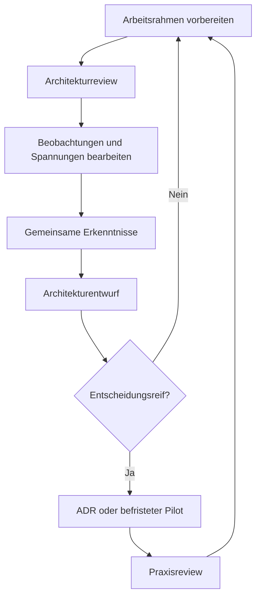

# RRLA-Arbeitsmethodik und Architekturprozess

Status: Akzeptierte Arbeitsmethodik
Verantwortung: Hauptstammleitung
Letzte Aktualisierung: 2026-07-14

## Warum gibt es dieses Kapitel?

Die RRLA soll weder als fertiges Modell der Hauptstammleitung noch als
basisdemokratische Sammlung einzelner Meinungen entstehen. Dieses Kapitel
definiert einen Prozess mit klarer Architekturverantwortung und echter
Mitgestaltung.

## Kontext

Der Stamm ist stark gewachsen. Seine Leitungsarchitektur soll nun bewusst
weiterentwickelt werden. Die Hauptstammleitung hält das Big Picture; der SLK
besitzt praktische Erfahrung und trägt die spätere Arbeitsweise. Beides wird für
eine tragfähige Architektur benötigt.

## Beobachtungen

- Fertige Lösungen erzeugen wenig Mitverantwortung, wenn Betroffene erst am Ende
  einbezogen werden.
- Ein völlig leeres Blatt überfordert große Gruppen und begünstigt
  Endlosdiskussionen.
- Architektur ist nicht neutral: Auch Methodik und Reihenfolge müssen reviewbar
  bleiben.
- Entscheidungen verlieren ohne dokumentierten Kontext mit der Zeit ihre
  Verständlichkeit.

## Spannungsfelder

- klare Architekturverantwortung ↔ echte Mitgestaltung
- konsistentes Big Picture ↔ lokale Erfahrung
- zielgerichtete Moderation ↔ offene Ergebnisse
- nachvollziehbare Versionierung ↔ niedrige Zugangshürde
- Stabilität ↔ kontinuierliches Lernen

## Leitfragen

- Ist der Rahmen offen genug, damit der SLK ihn ernsthaft prüfen kann?
- Ist gleichzeitig klar, wer Konsistenz und Fortschritt verantwortet?
- Wer besitzt für eine konkrete Entscheidung das Mandat?
- Wie werden abweichende Perspektiven sichtbar, ohne jede Frage im Konsens zu
  entscheiden?
- Wann ist ein Ergebnis eine Erkenntnis, ein Entwurf oder eine Entscheidung?

## Gemeinsame Erkenntnisse

Dieser Abschnitt wird nach Reviews und Workshops ergänzt.

- Noch offen.

## Architekturentwurf

### Drei Ebenen der Zusammenarbeit

1. **Architekturverantwortung – Hauptstammleitung**
   Verantwortet Methodik, Reihenfolge, Moderation, Big Picture, Konsistenz,
   Templates, Visualisierungen und Versionierung.

2. **Architekturreview – SLK**
   Prüft Rahmen, Sprache, Vollständigkeit, Praxistauglichkeit und Auswirkungen.
   Der SLK darf auch die Architektur selbst verändern helfen.

3. **Inhaltsentwicklung – SLK und passende Fachleute**
   Entwickeln die Antworten in Workshops innerhalb des geprüften Rahmens.

### Arbeitszyklus

### Dokumenttypen

| Typ | Zweck | Enthält verbindliche Entscheidung? |
|---|---|---|
| Arbeitsdokument | Kontext, Beobachtungen, Spannungen und Leitfragen | Nein |
| Workshop-Unterlage | Moderation, Fragen und Ergebnissicherung | Nein |
| Architekturentwurf | zusammenhängender Vorschlag nach der Diskussion | Noch nicht |
| ADR | autorisierte Entscheidung mit Begründung und Konsequenzen | Ja |
| Pilotbeschreibung | befristeter Lernversuch mit Review-Termin | Nur für den Pilotzeitraum |

### Standardstruktur für Arbeitsdokumente

1. Warum gibt es dieses Kapitel?
2. Kontext
3. Beobachtungen
4. Spannungsfelder
5. Leitfragen
6. Gemeinsame Erkenntnisse
7. Architekturentwurf
8. Architekturentscheidung / ADR

Wo die Struktur für ein reines Nachschlagewerk keinen Mehrwert bietet, darf sie
gekürzt werden.

## Architekturentscheidung / ADR

- [`ADR-0003`](../08-decisions/adr-0003-github-als-architecture-workspace.md):
  GitHub als Architecture Workspace und Organisationsgedächtnis
- [`ADR-0004`](../08-decisions/adr-0004-gemeinsamer-architekturprozess.md):
  RRLA als gemeinsamer, iterativer Architekturprozess

## Review

Die Methodik wird nach dem ersten SLK-Workshop und anschließend halbjährlich
darauf geprüft, ob sie Mitgestaltung, Klarheit und Fortschritt tatsächlich
unterstützt.
