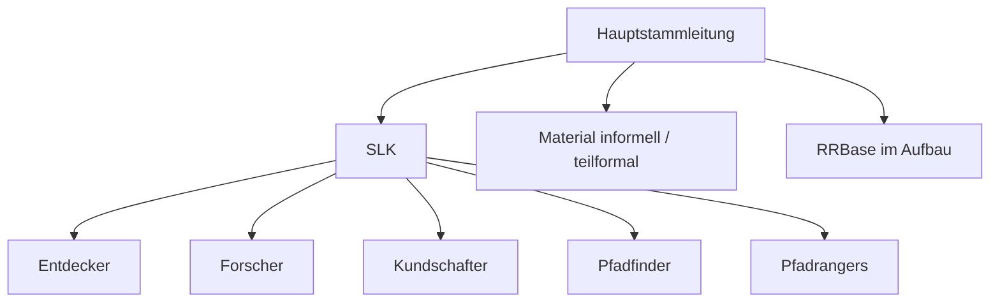

# 00 Introduction

Dieser Bereich beschreibt, warum RRLA existiert, wie wir arbeiten und welche
Ausgangslage wir vorfinden.

Er ist bewusst von der Zielarchitektur getrennt. Hier sammeln wir Diagnose,
Kontext und Spannungen. Loesungen entstehen erst in den spaeteren Schichten.

## Zweck

- gemeinsames Problemverstaendnis schaffen
- heutige Struktur sichtbar machen
- Symptome von Ursachen trennen
- Arbeitsweise fuer RRLA klaeren
- Material fuer spaetere Entscheidungen sammeln

## Aktuelle Ausgangslage

Der Stamm ist in 33 Jahren stark gewachsen:

- von ca. 30 Kindern auf ca. 300 Teilnehmer
- von 7 Mitarbeitern auf 78 Mitarbeiter
- auf 5 Teilstaemme mit insgesamt 25 Teams

Die Struktur ist mitgewachsen, aber nicht neu entworfen worden. Viele heutige
Spannungen entstehen deshalb nicht durch fehlendes Engagement, sondern durch ein
Fuerungsmodell, das fuer eine kleinere Organisation gebaut wurde.

## Aktuelle Hauptspannungen

- Operative Entscheidungen landen zu oft im SLK.
- Verantwortung und Entscheidung sind nicht immer gekoppelt.
- Gesamt-Mitarbeitertreffen hat keinen klaren Zweck.
- Kommunikation laeuft zu stark ueber WhatsApp und ist unuebersichtlich.
- Fachbereiche wie Medien, Kommunikation, IT oder Ausbildung sind noch nicht
  sauber formiert.
- Material ist bereits ein Bereich, aber Prozesse, Inventar und Erwartungen sind
  noch nicht klar genug.
- Junge Leiter sollen Verantwortung uebernehmen, erleben aber haeufig
  Absicherungskultur.

## Ist-Struktur in Kurzform

## Leitfragen

- Welche Probleme sind Symptome einer fehlenden Struktur?
- Welche Probleme sind Kulturfragen?
- Welche Probleme sind reine Umsetzungsfragen?
- Welche Themen muessen sofort stabilisiert werden?
- Welche Themen duerfen warten, bis das Zielbild klarer ist?

## Ergebnis dieser Schicht

Diese Schicht ist ausreichend bearbeitet, wenn:

- die wichtigsten Spannungen benannt sind
- offene Fragen in `OPEN-QUESTIONS.md` stehen
- klar ist, welche Themen nicht sofort geloest werden
- Mission und Vision als naechste Schicht bearbeitet werden koennen

## Naechster Schritt

Weiter mit [`01-mission`](../01-mission/README.md).
