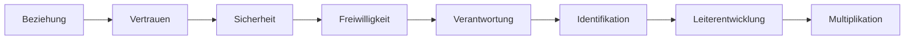
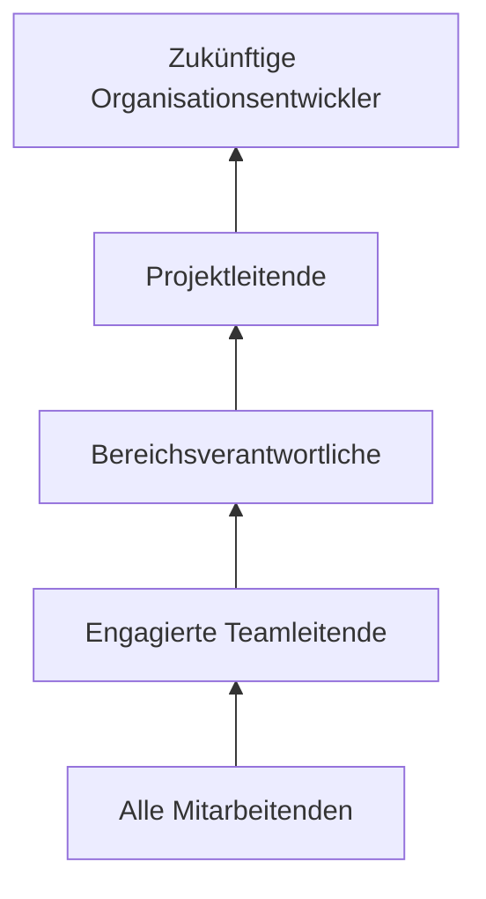

# 02 – Führungsphilosophie und Leiterentwicklung

Status: Arbeitsgrundlage; Inhalte sind Hypothesen für gemeinsame Workshops
Verantwortung: Hauptstammleitung für den Rahmen, SLK für Review und Mitentwicklung

## Warum gibt es dieses Kapitel?

Strukturen allein bringen keine Leiter hervor. Dieses Kapitel untersucht, wie
Menschen gesehen, angesprochen, in Verantwortung begleitet und langfristig zu
Leitenden entwickelt werden.

## Kontext

Der Stamm braucht nicht nur mehr helfende Hände, sondern Menschen, die
freiwillig und langfristig Verantwortung tragen können. Gleichzeitig kann eine
gut gemeinte persönliche Ansprache durch Erfahrung, Rolle oder geistliche
Autorität als Druck erlebt werden.

## Beobachtungen

- Persönliche Beziehung führt häufiger zu nachhaltiger Mitarbeit als ein
  allgemeiner Aufruf.
- Jüngere Leitende fühlen sich teils gesehen und ermutigt, teils aber auch
  verpflichtet oder überfordert.
- Eine angebotene Aufgabe wird wegen des Macht- oder Erfahrungsgefälles nicht
  immer als frei ablehnbar erlebt.
- Ein Nein kann unterschiedliche Ursachen haben und ist nicht automatisch
  mangelnde Hingabe.
- Große Veranstaltungen bieten echte Lernräume, werden aber noch nicht immer
  bewusst als Entwicklungsplattform geplant.
- Nicht alle Mitarbeitenden haben dieselbe Kapazität oder möchten dieselbe Form
  von Verantwortung übernehmen.

## Spannungsfelder

- Potenzial ansprechen ↔ keinen Druck erzeugen
- persönliche Ansprache ↔ echte Freiwilligkeit
- Zutrauen ↔ Überforderung
- klare Erwartungen ↔ Raum zum Ausprobieren
- Entwicklung der Person ↔ Besetzung einer dringenden Aufgabe
- Verantwortung übertragen ↔ Verantwortung gemeinsam annehmen
- Fehler ermöglichen ↔ Sicherheit und Kindeswohl schützen

## Leitfragen

### Menschenbild und Führung

- Woran erkennen Menschen bei uns, dass ihr Wert nicht von einer Rolle abhängt?
- Wie unterscheiden wir Potenzial, aktuelle Reife und verfügbare Kapazität?
- Wie gehen wir mit Einfluss und Machtgefälle bewusst um?

### Einladung und freies Ja

- Wie klingt eine Anfrage, bei der ein Nein wirklich möglich ist?
- Wie viel Bedenkzeit und welche Informationen braucht eine Person?
- Wie machen wir sichtbar, dass ein Nein die Wertschätzung nicht verändert?
- Wann ist aus einer Einladung eine gemeinsame Beauftragung geworden?

### Begleitung und Wachstum

- Wie kann Verantwortung zunächst klein, befristet oder in Co-Leitung erprobt
  werden?
- Wer begleitet, gibt Feedback und reflektiert mit?
- Woran erkennen wir, dass Verantwortung erweitert werden kann?
- Wie wird Nachfolge von Beginn an Teil einer Rolle?

### Veranstaltungen als Entwicklungsplattform

- Welche Entwicklungsziele hat ein Camp neben seinen operativen Zielen?
- Welche Nachwuchsleitenden sollen eine Schlüsselrolle begleitet erproben?
- Wie werden Lernerfahrungen nach dem Projekt reflektiert?

## Gemeinsame Erkenntnisse

Dieser Abschnitt wird in den Workshops mit dem SLK gefüllt.

- Noch offen.

## Architekturentwurf – zu prüfende Hypothesen

### Entwicklungsweg

```mermaid
flowchart LR
    A[Potenzial wahrnehmen] --> B[Beziehung vertiefen]
    B --> C[Verantwortung anbieten]
    C --> D[In Freiheit entscheiden]
    D --> E[Begleitet ausprobieren]
    E --> F[Gemeinsam reflektieren]
    F --> G[Beauftragen]
    G --> H[Verantwortung erweitern]
    H --> I[Andere entwickeln]
```

Verantwortung entsteht erst, wenn beide Seiten ein echtes Ja gefunden haben.
Eine Anfrage der Leitung allein ist noch kein Auftrag.

### Einladung und Beauftragung

**Einladung**

> Wir sehen Potenzial in dir. Könntest du dir vorstellen, diese Aufgabe
> befristet und begleitet auszuprobieren? Ein Nein ist in Ordnung und verändert
> unsere Wertschätzung nicht.

Eine Einladung ist offen, konkret, freiwillig und bietet Bedenkzeit.

**Beauftragung**

Eine Beauftragung folgt nach gemeinsamer Klärung von Aufgabe, Zeit, Mandat,
Leitplanken, Begleitung und einem beidseitigen Ja. Sie ist nicht mit einer
geistlichen Berufung gleichzusetzen.

### Mögliche Gründe für Zurückhaltung

| Mögliche Ursache | Passende Führungsantwort |
|---|---|
| Angst zu scheitern | Begleitung, Co-Leitung und sichere Lernschritte anbieten |
| Fehlende zeitliche Kapazität | Nein respektieren; nicht moralisch bewerten |
| Unklare Erwartungen | Ziel, Aufwand, Zeitraum und Mandat konkretisieren |
| Sorge, jemanden zu enttäuschen | Freiheit zum Nein ausdrücklich und glaubwürdig aussprechen |
| Geringe Selbstwirksamkeit | kleine Erfolgserlebnisse, Training und Feedback ermöglichen |
| Fehlender Sinnbezug | Beitrag zur Mission erklären und ehrlich prüfen |

Dabei sind zwei Diagnoseebenen zu unterscheiden:

**Systemische Gründe, warum Verantwortung kaum Raum bekommt**

1. fehlende persönliche Kapazität,
2. zu viele parallele Projekte und Rollen,
3. Aufgaben ohne echten Gestaltungsspielraum,
4. fehlende tragfähige Beziehung,
5. fehlender Sinnbezug.

**Persönliche Gründe, warum ein konkretes Angebot nicht angenommen wird**

Hierzu zählen unter anderem Angst zu scheitern, unklare Erwartungen, Sorge vor
Enttäuschung und geringe Selbstwirksamkeit. Die Unterscheidung ist wichtig: Ein
systemisches Portfolio-Problem wird nicht durch mehr Ermutigung gelöst; ein
unklarer Auftrag nicht durch einen allgemeinen Mitarbeitenden-Aufruf.

### Verantwortungskette

### Verantwortungspyramide als Ressourcenmodell

Die Pyramide ist keine Wert- oder Statushierarchie. Sie macht sichtbar, dass
nicht von allen dieselbe Verantwortung, Zeit oder Führungsspanne erwartet
werden kann.

### Führungsprinzipien zur gemeinsamen Prüfung

- **Beziehung erzeugt Mitarbeit** ist eine Arbeitshypothese: Offene
  Ausschreibungen ergänzen persönliche
  Ansprache, ersetzen sie aber nicht.
- Verantwortung wird angeboten und gemeinsam angenommen, nicht aufgezwungen.
- Ein freies Ja ist wertvoller als ein pflichtbewusstes Ja.
- Ein Nein verändert nicht die Wertschätzung einer Person.
- Führung muss ihre Wirkung beachten, nicht nur ihre Absicht.
- Führung schafft Sicherheit, damit Verantwortung freiwillig übernommen werden
  kann.
- Verantwortung wächst schrittweise mit Reife, Erfahrung und Kapazität.
- Leitende entwickeln Menschen, nicht nur Aufgaben.
- Begleitung dient Wachstum; Rechenschaft dient nicht der Kontrolle um ihrer
  selbst willen.
- **Vertrauen erzeugt Verantwortung; Verantwortung erzeugt Identifikation** wird
  als Wirkungskette gemeinsam geprüft, nicht als Automatismus vorausgesetzt.

## Architekturentscheidung / ADR

Noch keine inhaltliche Entscheidung. Die Hypothesen werden im SLK geprüft und
anschließend zu Prinzipien verdichtet. Sicherheits-, Kindeswohl- und
Integritätsgrenzen bleiben unabhängig davon verbindlich.

## Verknüpfte Themen

- [`Projekt- und Portfoliomodell`](../03-operating-model/project-and-portfolio.md)
- [`Backlog`](../07-roadmap/backlog.md)
