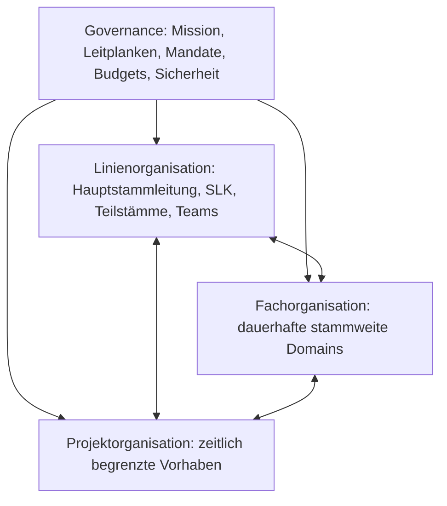

# 03 – Operating Model

Status: Arbeitsgrundlage; Zielmodell noch nicht beschlossen
Verantwortung: Hauptstammleitung für den Rahmen, SLK für Review und Mitentwicklung

## Warum gibt es dieses Kapitel?

Das Operating Model beschreibt, wie unterschiedliche Formen von Verantwortung
zusammenwirken. Es verhindert, dass Linie, Fachthemen, Projekte und Governance
in einem Gremium vermischt werden.

## Kontext

Heute tragen Teilstämme und Teams die kontinuierliche Arbeit. Gleichzeitig gibt
es stammweite Fachthemen und große, zeitlich begrenzte Veranstaltungen. Viele
dieser Themen werden im SLK zusammengeführt, obwohl sie unterschiedliche
Entscheidungslogiken brauchen.

## Beobachtungen

- Die Linienorganisation ist etabliert, stammweite Fachverantwortung dagegen
  nur teilweise.
- Veranstaltungen werden wiederkehrend durchgeführt, aber nicht durchgängig als
  temporäre Projekte mit eigenem Mandat geführt.
- Der SLK behandelt strategische, personelle, fachliche und operative Themen im
  selben Rhythmus.
- Gesamt-Mitarbeiterrunden werden teilweise für Planung und Personalgewinnung
  genutzt, obwohl nicht alle Teilnehmenden betroffen sind.
- Verantwortung und Entscheidungsrecht sind nicht überall deckungsgleich.

## Spannungsfelder

- Einheit ↔ dezentrale Verantwortung
- fachliche Standards ↔ Freiheit der Teilstämme
- Beteiligung ↔ klare Mandate
- stabile Linie ↔ temporäre Projekte
- Gesamtüberblick ↔ operative Geschwindigkeit
- Vertrauen ↔ Governance

## Leitfragen

### Linie

- Welche Entscheidungen gehören zu Hauptstammleitung, SLK, Teilstämmen und
  Teams?
- Welche Entscheidungen sollen ohne Hauptstammleitung möglich sein?
- Welche Rolle hat der SLK außerhalb des RRLA-Architekturprozesses?

### Fachorganisation

- Welche dauerhaften Themen brauchen stammweite fachliche Verantwortung?
- Wie werden Konflikte zwischen Domain und Teilstamm geklärt?
- Welche Standards sind verbindlich, welche Empfehlungen?

### Projektorganisation

- Ab welcher Größe braucht ein Vorhaben eine Projektleitung, Budget und
  Projektauftrag?
- Wie greifen Projektrollen auf Standards und Ressourcen der Domains zu?
- Wer startet, stoppt oder priorisiert ein Projekt?

### Governance

- Welche Leitplanken sind unverhandelbar?
- Wer setzt Budgetrahmen und Sicherheitsvorgaben?
- Wie wird Rechenschaft schlank, aber verlässlich gestaltet?
- Wie wird bei Ziel- oder Mandatskonflikten eskaliert?

## Gemeinsame Erkenntnisse

Wird nach den Operating-Model-Workshops ergänzt.

## Architekturentwurf – vier zusammenwirkende Perspektiven

### 1. Linienorganisation

Sichert kontinuierliche Führung, geistliche Verantwortung und die Arbeit mit
den Teilnehmenden:

- Hauptstammleitung
- SLK
- Teilstämme
- Teams

### 2. Fachorganisation

Bündelt dauerhafte stammweite Kompetenz und Standards, zum Beispiel Material,
Kommunikation, Medien, Ausbildung, IT/RRBase oder Finanzen. Domains unterstützen
Linie und Projekte; sie ersetzen die Teilstämme nicht.

### 3. Projektorganisation

Führt zeitlich begrenzte Vorhaben mit Start, Ende, Ziel, Budget, Mandat und
Projektleitung. Dazu gehören Sommercamp, Weihnachtsmarkt,
Mitarbeiterwochenende und Großaktionen.

### 4. Governance

Definiert den zulässigen Entscheidungsraum:

- Mission, Werte und geistliche Ausrichtung
- Kindeswohl, Sicherheit und Integrität
- Mandate und Entscheidungsbefugnisse
- Budgetrahmen und Rechenschaft
- Eskalations- und Konfliktwege

Governance trifft nicht jede Entscheidung. Sie macht verantwortliche,
dezentrale Entscheidungen sicher möglich.

### Gesamt-Mitarbeiterrunde – Arbeitshypothese

Die Gesamt-Mitarbeiterrunde dient künftig vor allem:

- geistlicher Zurüstung und Gebet,
- Vision und Kultur,
- gemeinsamem Lernen,
- wichtigen stammweiten Informationen,
- kurzen Statusupdates aus Projekten.

Operative Planung und Personalbesetzung finden in den jeweiligen Linien,
Domains oder Projekten statt.

### Entscheidungsprinzipien – Arbeitshypothesen

- Verantwortung und Entscheidung gehören zusammen.
- Entscheidungen werden auf der niedrigstmöglichen **geeigneten** Ebene
  getroffen.
- Die geeignete Ebene besitzt Kompetenz, Mandat, nötige Informationen und trägt
  die Auswirkungen.
- Höhere Ebenen setzen Leitplanken, lösen Konflikte oder entscheiden nur bei
  stammweiter Tragweite.

## Architekturentscheidung / ADR

Noch keine abschließende Entscheidung über das Operating Model. Das
Vier-Perspektiven-Modell und die Rolle der Gesamt-Mitarbeiterrunde werden im SLK
geprüft.

## Vertiefung

- [`project-and-portfolio.md`](project-and-portfolio.md)
- [`Domains`](../04-domains/README.md)
