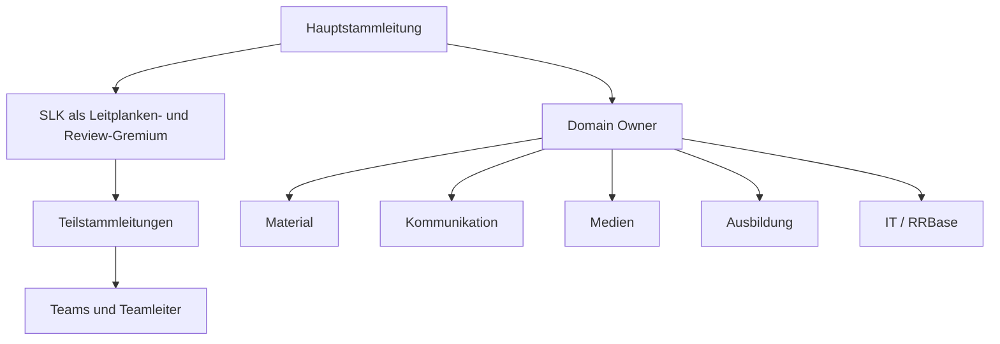

# 03 Operating Model

Diese Schicht beschreibt, wie der Stamm gefuehrt wird.

Hier werden Rollen, Gremien, Entscheidungswege, Meetings und Eskalationswege
definiert. Erst jetzt entsteht ein konkretes Organisationsmodell.

## Zweck

- Hauptstammleitung entlasten
- SLK neu ausrichten
- Verantwortung und Entscheidung koppeln
- Teilstaemme, Domains und Projekte zusammenfuehren
- Meeting-System vereinfachen

## Leitfragen

### Hauptstammleitung

- Was ist die eigentliche Aufgabe der Hauptstammleitung?
- Welche operativen Themen gehoeren nicht mehr dorthin?
- Welche Entscheidungen muessen dort bleiben?
- Wie wird Nachfolge vorbereitet?
- Wie reduzieren wir das Klumpenrisiko Ehepaar?

### SLK

- Ist der SLK Entscheidungsgremium, Review Board oder beides?
- Welche Entscheidungen gehoeren zwingend in den SLK?
- Welche Themen werden nur informiert?
- Wie geht der SLK mit Widerspruch um?
- Wie wird "disagree and commit" gelebt?

### Teilstaemme

- Welche Verantwortung haben Stammleiter und Stammwarte?
- Wo entscheiden Teilstaemme eigenstaendig?
- Wo muessen sie gemeinsame Leitplanken beachten?

### Domains

- Welche fachlichen Bereiche brauchen Owner?
- Wie greifen Domain-Owner und Teilstammleiter ineinander?
- Wer entscheidet bei Konflikten?

### Meetings

- Welches Meeting hat welchen Zweck?
- Welche Meetings dienen Zuruestung?
- Welche Meetings dienen Entscheidung?
- Welche Meetings dienen Projektarbeit?
- Was muss nicht mehr im Gesamt-Mitarbeitertreffen stattfinden?

## Zielbild in Kurzform

## Ergebnisartefakte

Empfohlene Dateien:

- `roles.md`
- `decision-model.md`
- `meeting-system.md`
- `governance.md`

## Definition of Done

Diese Schicht ist ausreichend bearbeitet, wenn:

- Hauptstammleitung, SLK, Teilstaemme, Domains und Projekte klar unterschieden sind
- Entscheidungsrechte beschrieben sind
- Meeting-Zwecke klar getrennt sind
- Konfliktregel zwischen Linie, Domain und Projekt existiert
- notwendige ADRs angelegt sind

## Naechster Schritt

Weiter mit [`04-domains`](../04-domains/README.md).
