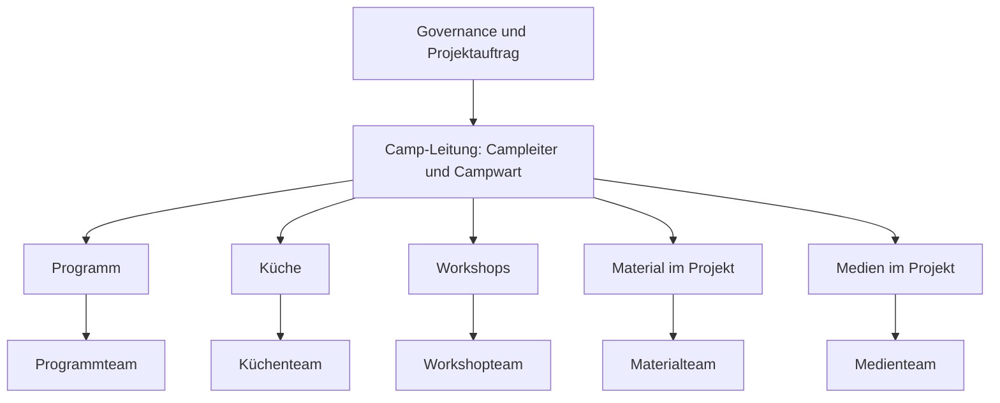
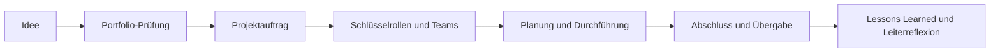

# Projektorganisation und Portfolio-Denken

Status: Arbeitsgrundlage; Klassifikation von Veranstaltungen als Projekte ist
gesetzt, Ausgestaltung wird im SLK entwickelt
Verantwortung: Hauptstammleitung für den Rahmen

## Warum gibt es dieses Kapitel?

Große Veranstaltungen benötigen temporäre Führung, konkurrieren um dieselben
Leitenden und bieten zugleich starke Entwicklungsräume. Dieses Kapitel verbindet
Projektführung, Portfolio-Entscheidungen und Leiterentwicklung.

## Kontext

Sommercamp, Weihnachtsmarkt, Mitarbeiterwochenende und Großaktionen haben einen
definierten Zeitraum, konkrete Ziele, ein Budget und hohen Ressourcenbedarf. Sie
sind deshalb Projekte – keine dauerhaften Domains.

## Beobachtungen

- Projektplanung landet teilweise im SLK oder in der Gesamt-Mitarbeiterrunde.
- Allgemeine Aufrufe führen nicht immer zu tragfähiger Rollenbesetzung.
- Die Camp-Leitung muss zu viele Einzelpersonen koordinieren, wenn
  Schlüsselrollen und Teamaufbau nicht klar delegiert sind.
- Mehrere gute Vorhaben konkurrieren um dieselben erfahrenen Leitenden.
- Projekterfolg wird hauptsächlich an Durchführung, seltener an gewachsenen
  Leitenden gemessen.

## Spannungsfelder

- Projektqualität ↔ Entwicklungsraum
- persönliche Ansprache ↔ freie Entscheidung
- ambitionierte Ideen ↔ verfügbare Leitungskapazität
- Projektfreiheit ↔ stammweite Standards
- Tempo ↔ Beteiligung

## Leitfragen

- Welches Mandat brauchen Projektleitung und Schlüsselrollen?
- Welche Entscheidungen bleiben bei Governance oder Domains?
- Wie wird Leitungskapazität vor Projektstart sichtbar bewertet?
- Wie viele parallele Großprojekte kann der Stamm gesund tragen?
- Welche Leitenden sollen im Projekt gezielt wachsen?
- Wie wird nach Projektende gelernt und Wissen gesichert?

## Gemeinsame Erkenntnisse

Wird nach dem Workshop ergänzt.

## Architekturentwurf

### Projektstruktur am Beispiel Camp

Die Camp-Leitung führt primär die Verantwortlichen der Schlüsselbereiche. Diese
stellen ihre Teams innerhalb von Mandat und Leitplanken eigenständig zusammen.
Projektrollen wenden stammweite Standards der zugehörigen Domains an.

### Personalgewinnung

1. Projektleitung klärt wenige Schlüsselrollen persönlich.
2. Schlüsselverantwortliche prüfen Kapazität und nehmen die Verantwortung frei
   an.
3. Sie sprechen geeignete Personen persönlich an.
4. Offene Ausschreibungen ergänzen die Ansprache.
5. Erst verbleibende Rollen werden breit ausgeschrieben.

Verantwortung wird angeboten, nicht durch eine Anfrage faktisch angeordnet.

### Projektlebenszyklus

### Portfolio-Prüfung

Vor einem Projektstart werden mindestens folgende Fragen beantwortet:

- Welchen Beitrag leistet das Projekt zu Mission und Vision?
- Welche Leitungskapazität bindet es – in welchen Monaten und Rollen?
- Welche laufenden Vorhaben konkurrieren um dieselben Menschen?
- Welches andere Vorhaben wird verschoben, verkleinert oder beendet?
- Ist der erwartete geistliche, pädagogische und organisationale Nutzen größer
  als die gebundene Führungsenergie?
- Wer übernimmt die Projektleitung freiwillig und mit ausreichendem Mandat?

> **Leitungskapazität ist unsere wertvollste Ressource.** Nicht Geld, Material
> oder Gebäude tragen ein Vorhaben, sondern Menschen, die Verantwortung
> übernehmen können. Deshalb wird nicht jedes gute Projekt umgesetzt.

### Zwei gleichwertige Erfolgskriterien

1. Das Projekt wurde sicher, wirksam und im vereinbarten Rahmen durchgeführt.
2. Menschen konnten Verantwortung erproben, reflektieren und als Leitende
   wachsen.

Leiterentwicklung ist kein zufälliger Nebeneffekt, sondern Teil des
Projektauftrags.

## Architekturentscheidung / ADR

Die Klassifikation großer Veranstaltungen als Projekte ist Teil des
beauftragten RRLA-Rahmens. Projektmandat, Portfolio-Gremium, Schwellenwerte und
Review-Rhythmus sind noch offen und werden vor einem verbindlichen ADR im SLK
entwickelt.
