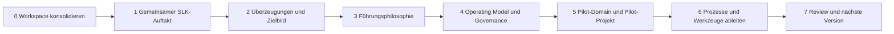

# 07 – Roadmap

Die Roadmap beschreibt den Lern- und Entscheidungsweg, nicht die Produktion
möglichst vieler Dokumente. Geschwindigkeit wird daran gemessen, ob gemeinsames
Verständnis und handlungsfähige Entscheidungen entstehen.

## Leitplanken

- Ein Workshop-Zyklus behandelt eine zentrale Frage.
- Architekturentwürfe folgen auf gemeinsame Erkenntnisse, nicht umgekehrt.
- Akute Verbesserungen dürfen als Pilot erfolgen, wenn sie dem Zielbild nicht
  widersprechen.
- Neue Projekte werden gegen Leitungskapazität und das Gesamtportfolio geprüft.
- Tool-Arbeit folgt geklärten Rollen und Prozessen.

## Entwicklungsweg

## Phasen und Entscheidungstore

| Phase | Ergebnis | Gate für den nächsten Schritt |
|---|---|---|
| 0. Workspace | konsistente Methodik, Vorlagen, Workshop-Paket | Hauptstammleitung kann den Prozess erklären |
| 1. SLK-Auftakt | gemeinsame Beobachtungen und Spannungsfelder | SLK trägt die Arbeitsweise und den nächsten Zyklus mit |
| 2. Fundament | gemeinsame Aussagen zu Gott, Menschen, Leitung, Wachstum und Zielbild | Widersprüche sind sichtbar; Kernüberzeugungen sind formulierbar |
| 3. Führungsphilosophie | Prinzipien zu Freiwilligkeit, Macht, Verantwortung und Entwicklung | Prinzipien sind praktisch verständlich und reviewt |
| 4. Operating Model | Entwurf für Linie, Domains, Projekte, Governance und Entscheidungen | Mandate und Konfliktwege sind pilotierbar |
| 5. Piloten | eine Pilot-Domain und ein Pilot-Projekt | Lernen ist dokumentiert; Anpassungen sind entschieden |
| 6. Prozesse & Tools | priorisierte Abläufe und abgeleitete Tool-Anforderungen | Owner, Nutzen und Einführung sind geklärt |
| 7. Review | RRLA-Version mit Entscheidungen und offenen Fragen | nächster Zyklus priorisiert |

## Empfohlener nächster Schritt

Den ersten SLK-Auftakt mit den Unterlagen unter
[`01-workshops/01-slk-auftakt`](../01-workshops/01-slk-auftakt/README.md)
durchführen. Danach nicht sofort das Operating Model entwerfen, sondern zuerst
die gemeinsamen Überzeugungen und das Zielbild bearbeiten.

## Backlog

Prioritäten, offene Architekturfragen und Hypothesen stehen in
[`backlog.md`](backlog.md).
