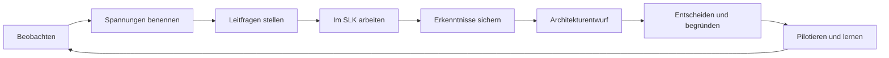
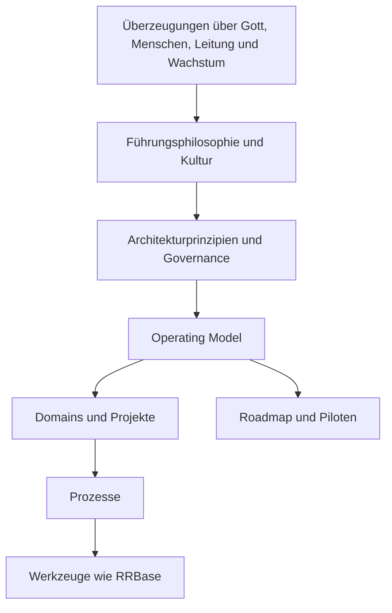

# Royal Rangers Leadership Architecture (RRLA)

Die RRLA ist kein fertiges Handbuch und kein Regelwerk. Sie ist ein gemeinsamer
Architektur- und Denkprozess: Wir entwickeln eine gemeinsame Sprache dafür, wie
wir über Gott, Menschen, Leitung, Wachstum, Verantwortung und Entscheidungen
sprechen – und leiten daraus schrittweise eine tragfähige Leitungsarchitektur ab.

> Die RRLA gibt Orientierung, nicht Kontrolle.

## Wozu dieses Repository dient

GitHub ist der **Architecture Workspace** und das **Organisationsgedächtnis** der
RRLA. Hier werden Arbeitsgrundlagen, Beobachtungen, Leitfragen,
Workshop-Erkenntnisse, Entwürfe, Entscheidungen und deren Hintergründe
nachvollziehbar versioniert.

Das Repository ist nicht die fertige Antwort. Es schafft einen belastbaren
Rahmen, in dem Antworten gemeinsam entstehen können.

## So entsteht die RRLA

Die Hauptstammleitung verantwortet Methodik, Big Picture, Konsistenz,
Reihenfolge, Templates, Visualisierungen und Versionierung. Der SLK wirkt als
Architecture Review Board, prüft auch den Rahmen und entwickelt die Inhalte in
Workshops mit. Fachleute und weitere Betroffene werden passend zum Thema
einbezogen.

## Kernmodell

Die zentrale Leitfrage lautet:

> **Was glauben wir über Gott, Menschen, Leitung und Wachstum – und welche
> Konsequenzen hat das für die Art, wie wir unseren Stamm führen?**

Aus den gemeinsamen Antworten entwickeln sich Führungsphilosophie, Governance,
Operating Model, Domains, Prozesse, Werkzeuge und Roadmap.

## Repository-Struktur

| Bereich | Zweck |
|---|---|
| [`START-HERE.md`](START-HERE.md) | Konkreter Einstieg für die Hauptstammleitung |
| [`00-foundation`](00-foundation/README.md) | Präambel, Ausgangslage, Methodik und Architekturprozess |
| [`01-workshops`](01-workshops/README.md) | Workshop-Fahrplan und Arbeitsunterlagen, beginnend mit dem SLK-Auftakt |
| [`02-leadership-philosophy`](02-leadership-philosophy/README.md) | Menschenbild, Verantwortung und Leiterentwicklung als Arbeitsfeld |
| [`03-operating-model`](03-operating-model/README.md) | Linie, Fachorganisation, Projekte, Governance und Portfoliosteuerung |
| [`04-domains`](04-domains/README.md) | Dauerhafte fachliche Verantwortungsbereiche |
| [`05-processes`](05-processes/README.md) | Wiederholbare Abläufe nach Klärung von Verantwortung und Mandat |
| [`06-tools`](06-tools/README.md) | Aus der Architektur abgeleitete Werkzeuganforderungen |
| [`07-roadmap`](07-roadmap/README.md) | Entwicklungsweg, Backlog, offene Fragen und nächste Schritte |
| [`08-decisions`](08-decisions/README.md) | Architecture Decision Records (ADRs) und Entscheidungshistorie |
| [`templates`](templates/README.md) | Einheitliche Vorlagen für Arbeitsdokumente, Workshops und ADRs |
| [`appendix`](appendix/README.md) | Glossar und gezielte Referenzen |

## Jetzt starten

1. [`START-HERE.md`](START-HERE.md) lesen.
2. Die Methodik in
   [`00-foundation/architecture-process.md`](00-foundation/architecture-process.md)
   gemeinsam klären.
3. Den ersten SLK-Workshop mit
   [`01-workshops/01-slk-auftakt`](01-workshops/01-slk-auftakt/README.md)
   vorbereiten und durchführen.
4. Ergebnisse in den vorgesehenen Arbeitsdokumenten sichern – nicht sofort in
   endgültige Regeln verwandeln.
5. Entscheidungen erst dann als ADR festhalten, wenn Entscheidungsträger,
   Begründung und Konsequenzen klar sind.

## Leitplanken für die Arbeit

- Beobachtung, Deutung, Hypothese, Entwurf und Entscheidung bleiben getrennt.
- Beteiligung bedeutet nicht, dass jeder alles entscheidet.
- Architekturverantwortung und echte Mitgestaltung gehören zusammen.
- Werkzeuge folgen der Organisation; sie bestimmen sie nicht.
- Nicht jede gute Idee wird umgesetzt.
- Leitungskapazität wird vor Geld, Material und Terminen geprüft.
- Inhalte bleiben veränderbar; Entscheidungen bleiben nachvollziehbar.
