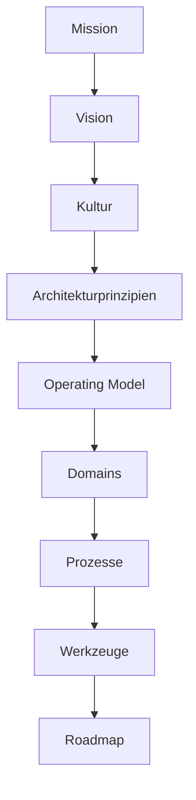

# Royal Rangers Leadership Architecture (RRLA)

RRLA ist das Leadership Operating System fuer unseren Royal Rangers Stamm.

Es beschreibt nicht nur eine Organisationsstruktur, sondern die Art, wie wir
Vision, Kultur, Verantwortung, Entscheidungen, Bereiche, Prozesse und Werkzeuge
so ordnen, dass der Stamm langfristig gesund wachsen kann.

## Ziel

Wir entwickeln eine Leitungsarchitektur, die den Stamm fuer die naechsten
10 bis 15 Jahre traegt und Wachstum auf 500+ Teilnehmer und 100+ Mitarbeiter
ermoeglicht, ohne dass die Hauptstammleitung zum Flaschenhals wird.

Das Ziel ist kein perfektes Handbuch, sondern ein lebendiges System, das neue
Leiter verstehen laesst:

- warum wir Dinge tun
- wie Entscheidungen entstehen
- wer Verantwortung traegt
- welche Kultur wir schuetzen
- welche Werkzeuge uns dienen

## Einstieg

Startet hier:

1. [`START-HERE.md`](START-HERE.md) lesen.
2. [`00-introduction/README.md`](00-introduction/README.md) durcharbeiten.
3. Mit [`01-mission/README.md`](01-mission/README.md) beginnen.
4. Offene Punkte in [`OPEN-QUESTIONS.md`](OPEN-QUESTIONS.md) festhalten.
5. Wichtige Entscheidungen als ADR in [`08-adr`](08-adr/README.md) dokumentieren.

## Architektur-Schichten

Wir arbeiten bewusst von oben nach unten. Werkzeuge wie RRBase folgen der
Architektur, nicht umgekehrt.

## Repository-Struktur

| Bereich | Zweck | Art |
|---|---|---|
| [`00-introduction`](00-introduction/README.md) | Kontext, Arbeitsweise, Ist-Analyse | Einstieg und Diagnose |
| [`01-mission`](01-mission/README.md) | Mission und Vision 2035 | Zielarchitektur |
| [`02-culture`](02-culture/README.md) | Kultur, Leadership Principles, Architekturprinzipien | Zielarchitektur |
| [`03-operating-model`](03-operating-model/README.md) | Rollen, Gremien, Entscheidungswege, Meetings | Zielarchitektur |
| [`04-domains`](04-domains/README.md) | Fachliche Verantwortungsbereiche und Owner | Zielarchitektur |
| [`05-processes`](05-processes/README.md) | Wiederholbare Kernprozesse | Zielarchitektur |
| [`06-tools`](06-tools/README.md) | RRBase, WhatsApp, Website, Cloud, Inventar und weitere Werkzeuge | Zielarchitektur |
| [`07-roadmap`](07-roadmap/README.md) | Backlog, Sprints, Umsetzung | Umsetzung |
| [`08-adr`](08-adr/README.md) | Architecture Decision Records | Entscheidungen |
| [`templates`](templates/README.md) | Einheitliche Vorlagen | Arbeitsmittel |
| [`appendix`](appendix/README.md) | Glossar, Referenzen, Anhaenge | Nachschlagewerk |

## Arbeitsprinzipien

- Zielbild vor Massnahme.
- Klarheit vor Vollstaendigkeit.
- Verantwortung und Entscheidung gehoeren zusammen.
- Der SLK prueft und schaerft die Architektur, er erfindet nicht jedes Detail neu.
- Domain-Experten gestalten ihre Bereiche innerhalb der gemeinsamen Leitplanken.
- Entscheidungen werden nachvollziehbar dokumentiert.
- Werkzeuge bilden die Organisation ab, sie ersetzen sie nicht.

## Zusammenarbeit

Die erste Version entsteht in drei Kreisen:

1. Hauptstammleitung: entwirft das Big Picture.
2. SLK: prueft, hinterfragt, ergaenzt und committed sich auf die Richtung.
3. Domain-Experten: arbeiten einzelne Bereiche konkret aus.

Details stehen in [`CONTRIBUTING.md`](CONTRIBUTING.md).
