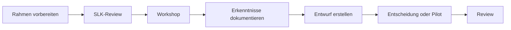

# Start- und Arbeitsanleitung

Diese Anleitung führt die Hauptstammleitung vom Repository zum ersten
gemeinsamen RRLA-Arbeitszyklus mit dem SLK.

## Was jetzt ausdrücklich nicht passiert

- Es wird keine fertige Zielorganisation vorgestellt.
- Der SLK bekommt kein bereits ausgefülltes Regelwerk zur Abnahme.
- Rollen werden noch keinen Personen zugewiesen.
- Akute Einzelprobleme bestimmen nicht die Gesamtarchitektur.
- RRBase oder andere Werkzeuge geben keine Organisationsstruktur vor.

## Schritt 1: Architekturverantwortung gemeinsam klären

Lest zu zweit:

- [`README.md`](README.md)
- [`00-foundation/architecture-process.md`](00-foundation/architecture-process.md)
- [`CONTRIBUTING.md`](CONTRIBUTING.md)

Klären solltet ihr nur:

- Wer moderiert den ersten Workshop?
- Wer hält Beobachtungen und Ergebnisse fest?
- Wie gebt ihr dem SLK echte Freiheit, den Rahmen zu prüfen?
- Wie verhindert ihr, dass eure eigenen Hypothesen als Beschlüsse erscheinen?

## Schritt 2: Ausgangslage vorbereiten

Prüft
[`00-foundation/context-and-observations.md`](00-foundation/context-and-observations.md).

Markiert jede Aussage als eine der folgenden Kategorien:

- belastbare Tatsache
- Beobachtung, die im SLK gespiegelt werden soll
- Hypothese, die noch geprüft werden muss

Ergänzt keine Lösungsvorschläge. Der erste Workshop beginnt mit gemeinsamer
Wahrnehmung.

## Schritt 3: Ersten SLK-Workshop vorbereiten

Verwendet das Paket unter
[`01-workshops/01-slk-auftakt`](01-workshops/01-slk-auftakt/README.md):

- [`facilitator-guide.md`](01-workshops/01-slk-auftakt/facilitator-guide.md)
  für Ablauf und Moderation
- [`participant-workbook.md`](01-workshops/01-slk-auftakt/participant-workbook.md)
  als Arbeitsblatt für die Teilnehmenden

Vor dem Termin:

1. Dauer und Raum festlegen; empfohlen sind 120 Minuten.
2. Arbeitsblatt ausdrucken oder digital bereitstellen.
3. Moderation und Dokumentation auf zwei Personen verteilen.
4. Beobachtungskarten oder Haftnotizen vorbereiten.
5. Entscheiden, welche Zahlen zur Entwicklung des Stammes belastbar sind.

## Schritt 4: Workshop durchführen

Das Ziel ist nicht Konsens über Lösungen. Der Workshop ist erfolgreich, wenn:

- der Veränderungsbedarf gemeinsam verstanden wird,
- Beobachtungen und Bewertungen getrennt wurden,
- die wichtigsten Spannungsfelder sichtbar sind,
- Rollen im RRLA-Prozess verstanden sind,
- der SLK den nächsten Arbeitszyklus mitträgt.

## Schritt 5: Ergebnisse sichern

Innerhalb von sieben Tagen:

1. Rohnotizen in klare Beobachtungen und Erkenntnisse überführen.
2. Neue Fragen in
   [`07-roadmap/backlog.md`](07-roadmap/backlog.md) aufnehmen.
3. Das Workshop-Dokument um „Gemeinsame Erkenntnisse“ ergänzen.
4. Noch keine inhaltlichen Entscheidungen erfinden.
5. Dem SLK eine kurze Ergebniszusammenfassung zum Gegenlesen geben.

## Schritt 6: Nächsten Zyklus auswählen

Der empfohlene nächste Arbeitszyklus behandelt die Kernfrage:

> Was glauben wir über Gott, Menschen, Leitung und Wachstum – und welche
> Konsequenzen hat das für die Art, wie wir unseren Stamm führen?

Erst daraus werden Vision, Führungsphilosophie und Architekturprinzipien
entwickelt. Der aktuelle Fahrplan steht in
[`07-roadmap/README.md`](07-roadmap/README.md).

## Arbeitsrhythmus

Für jedes Thema gilt:

Der Prozess darf iterieren. Ein früher Entwurf ist kein Versprechen und ein
Workshop-Ergebnis ist noch keine Entscheidung.
