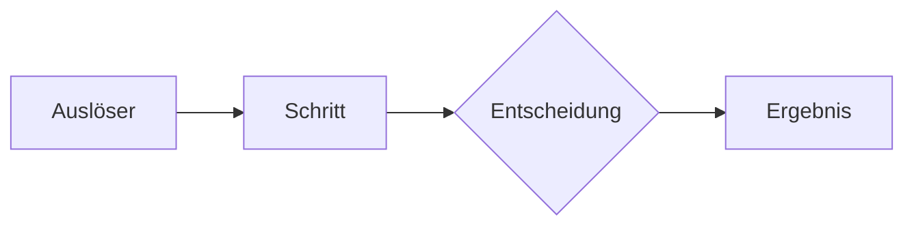

# Prozess-Kandidat: Name

Status: Arbeitsgrundlage
Vorgesehener Owner: ...
Domain / Projekt / Linie: ...

## Warum könnte dieser Prozess nötig sein?

Welches wiederkehrende Problem oder Risiko rechtfertigt einen definierten
Ablauf?

## Kontext

Welche Rollen, Entscheidungen und Werkzeuge sind betroffen?

## Beobachtungen

- ...

## Spannungsfelder

- Verlässlichkeit ↔ Einfachheit
- Standard ↔ situative Entscheidung
- ...

## Leitfragen

- Wer darf den Prozess festlegen und verändern?
- Was ist der kleinstmögliche verlässliche Ablauf?
- Welche Entscheidungspunkte brauchen ein Mandat?
- Welche Ausnahmen und Sicherheitsleitplanken gibt es?
- Was muss dokumentiert werden?

## Gemeinsame Erkenntnisse

Noch offen.

## Architekturentwurf

### Auslöser und Ergebnis

### Beteiligte Rollen und Entscheidungsrechte

| Rolle | Beitrag / Entscheidung |
|---|---|
| Owner | ... |
| Ausführend | ... |
| Zu beteiligen | ... |
| Zu informieren | ... |

### Minimaler Ablauf

### Leitplanken, Ausnahmen und Risiken

### Benötigte Informationen und Werkzeuge

### Erfolgs- und Reviewkriterien

## Architekturentscheidung / ADR

Noch keine – oder Link.
