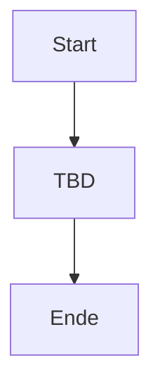

# Prozess: Name

Status: Entwurf
Owner: TBD
Domain: TBD
Letzte Aktualisierung: YYYY-MM-DD

## Zweck

Warum existiert dieser Prozess?

## Ausloeser

Was startet den Prozess?

## Beteiligte Rollen

| Rolle | Verantwortung |
|---|---|
| Owner | TBD |
| Ausfuehrend | TBD |
| Zu informieren | TBD |
| Entscheidung | TBD |

## Ablauf

## Entscheidungspunkte

Welche Entscheidungen entstehen im Prozess?

- TBD

## benoetigte Informationen

Welche Informationen, Dokumente oder Nachweise braucht der Prozess?

- TBD

## Werkzeuge

Welche Tools unterstuetzen den Prozess?

- TBD

## Risiken und Leitplanken

Welche Risiken muessen vermieden werden?

- TBD

## Definition of Done

Wann ist der Prozess erfolgreich abgeschlossen?

- TBD

## Offene Fragen

- Q-XXX: TBD
